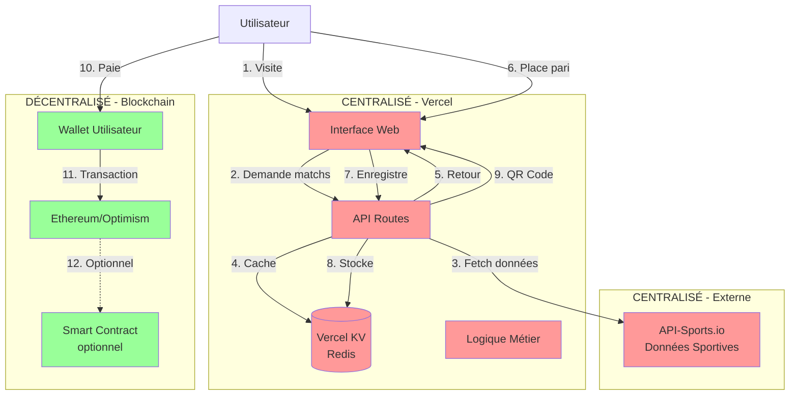
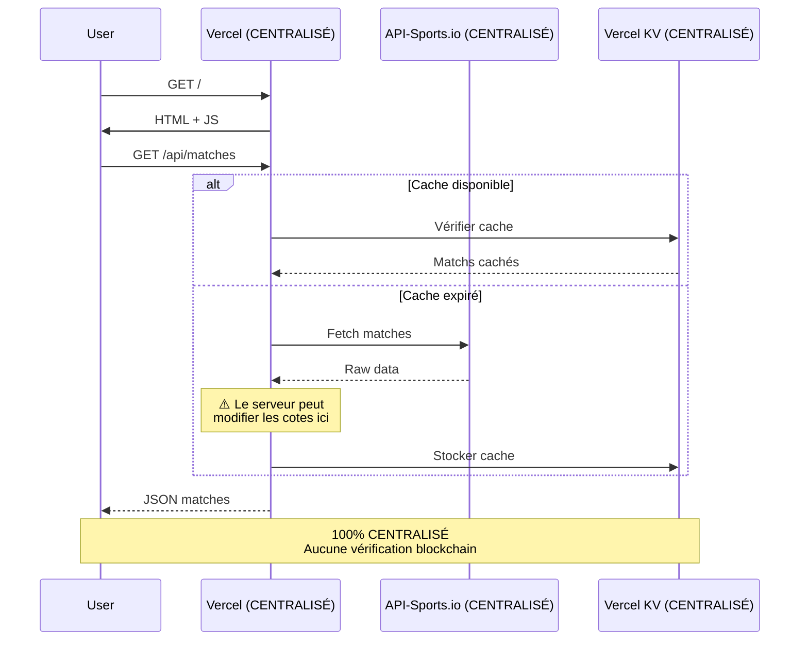
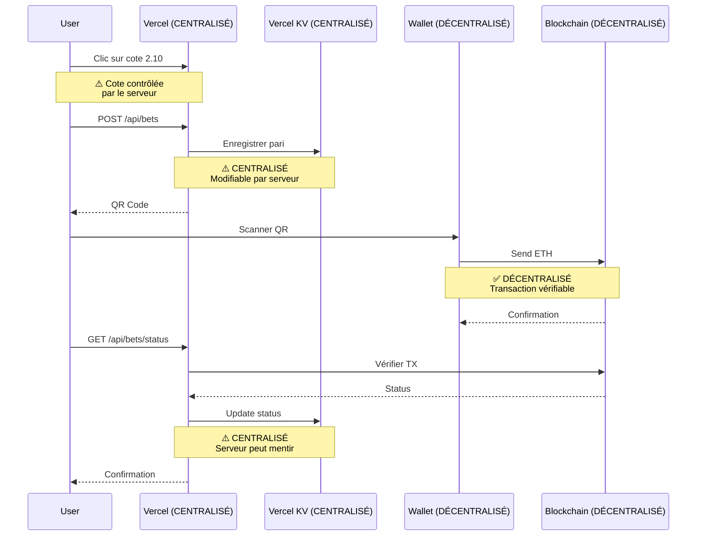

# Architecture Technique - CryptoBet v2

## ⚠️ Avertissement: Architecture Hybride

**Cette application est HYBRIDE, pas entièrement décentralisée.**

### Répartition Centralisé vs Décentralisé

| Composant | Type | Justification |
|-----------|------|---------------|
| Frontend (UI) | **CENTRALISÉ** | Hébergé sur Vercel |
| API Routes | **CENTRALISÉ** | Serverless functions Vercel |
| Base de données | **CENTRALISÉ** | Vercel KV (Redis) |
| Données sportives | **CENTRALISÉ** | API-Sports.io |
| Logique métier | **CENTRALISÉ** | Côté serveur |
| Paiements | **DÉCENTRALISÉ** | Blockchain Ethereum |
| Wallet | **DÉCENTRALISÉ** | Contrôle utilisateur |
| Smart Contract | **DÉCENTRALISÉ** | On-chain (optionnel) |

## Diagramme d'Architecture Réel



**Légende:**
- 🔴 Rouge = Centralisé (contrôlé par le serveur)
- 🟢 Vert = Décentralisé (contrôlé par l'utilisateur)

## Points de Centralisation

### 1. Frontend (Vercel)

**Problème:**
- Le serveur Vercel peut être censuré
- Downtime possible
- Modifications possibles du code sans notification

**Solution décentralisée:**
```
Frontend actuel (Vercel)
    ↓
Migration vers IPFS
    ↓
Accès via ENS (cryptobet.eth)
    ↓
Code immuable et vérifiable
```

**Coût:** ~$50/an (ENS) + gratuit (IPFS)

### 2. API Routes (Serverless)

**Problème:**
- Contrôle total du serveur sur la logique
- Peut modifier les cotes
- Peut refuser des paris
- Logs centralisés

**Solution décentralisée:**
```
API Routes (Vercel)
    ↓
Smart Contracts
    ↓
Logique on-chain vérifiable
```

**Coût:** ~$0.50-5 par transaction (gas fees)

### 3. Base de Données (Vercel KV)

**Problème:**
- Données modifiables par le serveur
- Pas d'audit trail
- Historique non vérifiable
- Peut être perdu

**État actuel:**
```typescript
// lib/db.ts - CENTRALISÉ
export async function addBet(bet: Bet) {
  if (kvAvailable) {
    await kv.set(`bet:${bet.id}`, bet); // Stockage centralisé
    await kv.sadd('bets:all', bet.id);
  } else {
    memoryStore.bets.push(bet); // Encore plus centralisé!
  }
}
```

**Solution décentralisée:**
```solidity
// Smart Contract - DÉCENTRALISÉ
contract Bets {
    mapping(uint256 => Bet) public bets; // Stockage on-chain
    
    function placeBet(uint256 matchId, uint8 betType) 
        external 
        payable 
    {
        bets[betCounter] = Bet({
            user: msg.sender,
            matchId: matchId,
            betType: betType,
            amount: msg.value
        });
        emit BetPlaced(betCounter, msg.sender);
    }
}
```

**Coût:** ~$5-20 par pari (gas fees Ethereum)  
**Alternative:** Optimism/Arbitrum (~$0.10-0.50)

### 4. Données Sportives (API-Sports.io)

**Problème:**
- Source unique de vérité
- Peut être manipulée
- Pas de vérification on-chain
- Quota limité

**État actuel:**
```typescript
// lib/services/sportsApi.ts - CENTRALISÉ
export async function getUpcomingMatches() {
  const response = await axios.get(
    'https://v3.football.api-sports.io/fixtures',
    { headers: { 'x-rapidapi-key': API_KEY } }
  );
  
  // Le serveur peut modifier ces données!
  return transformMatches(response.data);
}
```

**Solution décentralisée:**
```solidity
// Utilisation d'oracles Chainlink
contract SportsOracle {
    using Chainlink for Chainlink.Request;
    
    function requestMatchResult(uint256 matchId) 
        external 
        returns (bytes32 requestId) 
    {
        // Coût: ~$50-100 par requête
        Chainlink.Request memory req = buildChainlinkRequest(
            jobId,
            address(this),
            this.fulfill.selector
        );
        req.add("matchId", matchId);
        return sendChainlinkRequest(req, fee);
    }
}
```

**Coût:** ~$50-100 par match (oracle Chainlink)

## Flux de Données Réel

### Scénario 1: Affichage des Matchs



### Scénario 2: Placement d'un Pari



## Risques de Centralisation

### 1. Manipulation des Cotes

**Risque:**
```typescript
// Le serveur peut faire ça:
function generateOdds(match) {
  const fairOdds = calculateFairOdds(match);
  
  // Manipulation possible!
  if (tooManyBetsOnTeam1) {
    fairOdds.team1 *= 0.8; // Réduire les cotes
  }
  
  return fairOdds;
}
```

**Mitigation:**
- Publier hash des cotes on-chain
- Signature cryptographique
- Audit externe régulier

### 2. Censure

**Risque:**
- Vercel peut bloquer l'accès
- DNS peut être saisi
- Serveur peut refuser certains utilisateurs

**Mitigation:**
- Déployer aussi sur IPFS
- Utiliser ENS pour le domaine
- Fournir plusieurs points d'accès

### 3. Perte de Données

**Risque:**
```typescript
// Vercel KV peut perdre les données
if (kvAvailable) {
  await kv.set(`bet:${id}`, bet);
} else {
  // Stockage en mémoire = perdu au redémarrage!
  memoryStore.bets.push(bet);
}
```

**Mitigation:**
- Backup quotidien
- Réplication multi-région
- Émission d'events on-chain pour audit

### 4. Modification de l'Historique

**Risque:**
```typescript
// Le serveur peut modifier l'historique
async function updateBetResult(betId, result) {
  const bet = await kv.get(`bet:${betId}`);
  bet.result = result; // Aucune vérification!
  await kv.set(`bet:${betId}`, bet);
}
```

**Mitigation:**
- Merkle tree des paris
- Root hash publié on-chain
- Preuve cryptographique pour chaque pari

## Comparaison: Actuel vs Décentralisé

### Architecture Actuelle (Hybride)

**Coûts:**
- Vercel: $0-20/mois
- API-Sports: $0-10/mois
- **Total: $0-30/mois**

**Performance:**
- Chargement: <1s
- Placement pari: 2-5s
- Confirmation: 15-60s (blockchain)

**Limitations:**
- ❌ Serveur contrôle les cotes
- ❌ Données modifiables
- ❌ Point de défaillance unique
- ✅ Paiements décentralisés

### Architecture 100% Décentralisée

**Coûts:**
- IPFS: Gratuit
- ENS: $50/an
- Oracles Chainlink: $50-100/match
- Gas fees: $5-20/pari (Ethereum)
- **Total: $50,000+/an** (pour 1000 matchs)

**Performance:**
- Chargement: 5-10s (IPFS)
- Placement pari: 30-60s (blockchain)
- Confirmation: 15-60s (blockchain)

**Avantages:**
- ✅ Aucun contrôle serveur
- ✅ Données immuables
- ✅ Résistant à la censure
- ✅ Audit complet on-chain

## Recommandations

### Pour un MVP (Actuel)

✅ **Garder l'architecture hybride**
- Coût raisonnable
- UX acceptable
- Développement rapide

### Pour la Production

🔄 **Améliorer la transparence**
1. Publier hash des cotes on-chain
2. Signer cryptographiquement les données
3. Audit trail public
4. Open source le code serveur

### Pour la Décentralisation Complète

🎯 **Migration progressive**
1. **Phase 1**: Frontend sur IPFS
2. **Phase 2**: Oracles pour résultats critiques
3. **Phase 3**: Stockage on-chain des paris
4. **Phase 4**: DAO pour gouvernance

## Conclusion

**L'architecture actuelle est un compromis pragmatique:**

✅ **Avantages:**
- Coût accessible
- UX fluide
- Développement rapide
- Paiements décentralisés

❌ **Inconvénients:**
- Confiance requise envers le serveur
- Données centralisées
- Censure possible

**Pour les utilisateurs:**
- Comprendre que seuls les paiements sont décentralisés
- Le serveur contrôle les cotes et l'historique
- Vérifier les transactions on-chain
- Demander des audits réguliers

**Pour les développeurs:**
- Documenter clairement les points de centralisation
- Implémenter des mécanismes de vérification
- Planifier la migration vers plus de décentralisation
- Être transparent sur les limitations
